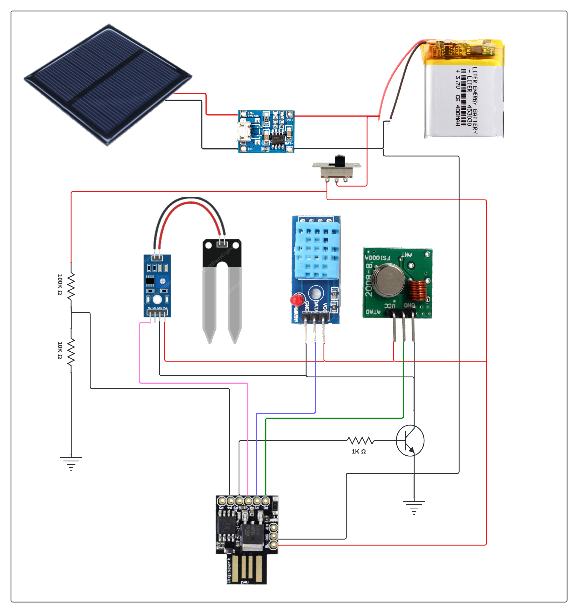

# Projeto
Simples projeto de sensor de umidade de solo alimentado com bateria de lítio, recarregada com placa fotovoltaica e envio de dados por RF 433mhz.

# Introdução
A ideia envolvida surge da necessidade de monitorar jardim ou horta sem ter a necessidade de aguar desnecessariamente o solo. A placa fotovoltaíca torna o equipamento autônomo, livre de cabos de alimentação ou retirada para recarregamento.

# Materiais
- Arduino Digispark pro USB
- Bateria de lítio/lípo
- Carregador de bateria de lítio
- Placa emissora de RF 433mhz
- Placa sensor de umidade de solo

# Observação
- Trata-se de um protótipo para fins de validação da ideia.
- O projeto é de emissor de dados, sendo o receptor desenvolvido posteriormente.
- Contribuições serão sempre bem-vindas.

# Circuito
Circuito simplificado:

# Projeto caixa 3D
Arquivo com o projeto da caixa para impressão 3D:
[arquivo.stl](others/box.stl)
